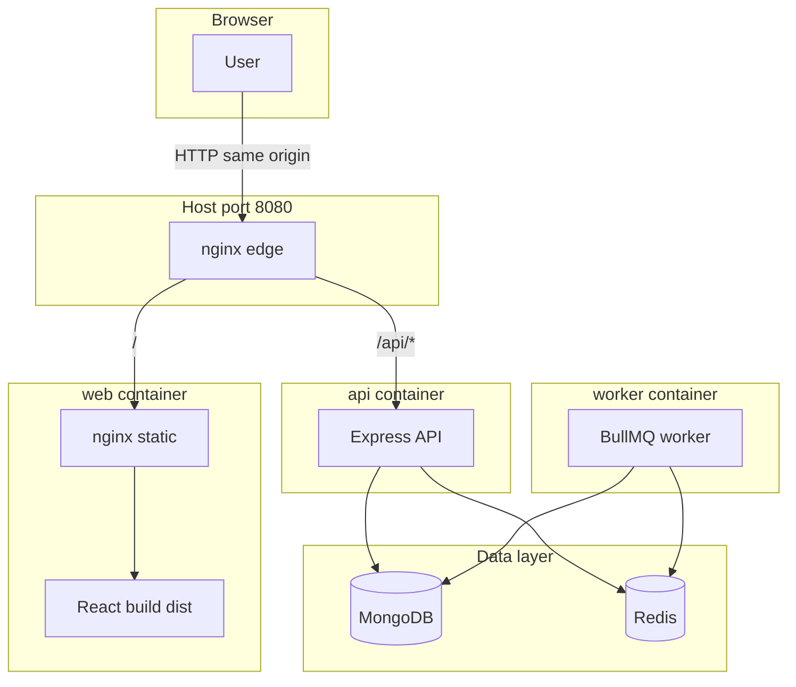

# meetings-app — architecture

This document explains how the pieces fit together, and **why Docker Compose** and **nginx** are part of the full-stack setup.

## What the app does (short)

Users sign in, create **meetings** (title + transcript), and request an **AI summary**. The API saves meetings in **MongoDB** and enqueues a **summarize** job in **Redis** (BullMQ). A separate **worker** process picks up jobs, calls the LLM (or a mock), and writes summary + status back to MongoDB. The **web** UI is a React SPA that talks to the API over **`/api`**.

## Diagram (full Docker stack)

**Data flow for “generate summary”:** Browser → nginx → API → Redis (job) → Worker → OpenAI (or mock if `MOCK_LLM=true`) → MongoDB → Browser polls API for updated meeting.

## Components

| Piece | Role |
|--------|------|
| **Web (React)** | Login, meetings CRUD, dashboard, account. Built to static files; expects API at **`/api`** on the **same host** (no CORS pain in production). |
| **API (Express)** | Auth (JWT), meetings, dashboard stats, user admin routes. Enqueues summarize jobs to Redis. Reads/writes MongoDB. |
| **Worker** | Long-running Node process. Consumes the **`summarize`** queue, updates meeting documents. Not reachable from the browser. |
| **MongoDB** | Users, meetings, summaries, job metadata fields. |
| **Redis** | BullMQ queue backend so summarization is **async** and survives API restarts (jobs live in Redis until processed). |
| **nginx (edge)** | The only service published on **8080** in dev. Terminates HTTP at one place and **routes** traffic. |
| **nginx (inside `web` image)** | Serves **`index.html`** and assets; **`try_files`** sends unknown paths to the SPA so React Router works on refresh. |

## Why Docker Compose?

**Docker Compose** is a single file (`infra/docker-compose.yml`) that defines **all** services (mongo, redis, api, worker, web, edge nginx) and how they connect.

**What it does for you**

- **Same environment everywhere:** “Works on my machine” becomes “same containers on laptop, CI, or a VPS.”
- **Networking:** Containers reach each other by **service name** (`mongo`, `redis`, `api`, `web`) on an internal Docker network. You do not hardcode random IPs.
- **One command:** `docker compose up --build` starts the full stack; `docker compose up -d mongo redis` starts only databases for local Node dev.
- **Dependencies:** `depends_on` + healthchecks wait until Mongo/Redis are ready before starting API/worker.

Compose is **not** the only way to deploy (you could run Node processes directly), but it is the **simplest** way to run **API + worker + DB + queue + static UI** consistently.

## Why nginx (edge)?

In **production-style** Compose, the browser should talk to **one origin** (e.g. `https://your-domain.com`). The SPA uses relative URLs like **`/api/meetings`**. That only works if something on that host forwards **`/api`** to Express and **`/`** to the static site.

**What the edge nginx does** (`infra/nginx.conf`)

1. **`location /api`** — Reverse-proxies to the **API** container (`api:3000`). Paths stay as `/api/...`, which matches how the Express app is mounted.
2. **`location /`** — Proxies to the **web** container’s nginx (`web:80`), which serves the built React app.

**Benefits**

- **Single public port** (8080 locally; 80/443 on a real server behind TLS).
- **No browser CORS** configuration for the common case (same scheme, host, port).
- **Clear split:** UI team ships static files; API team ships JSON; nginx is the stable **routing layer**.

The **inner** nginx in the `web` image only serves files and fixes SPA routing; the **edge** nginx is what combines **UI + API** under one hostname.

## Local dev without full Compose

For **Option B** in the README, you run **only** Mongo and Redis in Docker, and run **api**, **worker**, and **Vite** on the host. Vite’s dev server **proxies `/api` → localhost:3000**, which plays the same role as edge nginx during development.

## Related files

- `infra/docker-compose.yml` — service definitions and env wiring.
- `infra/nginx.conf` — edge routing (`/api` vs `/`).
- `apps/web/nginx-spa.conf` — SPA fallback inside the `web` image.
- `apps/api/src/db.js`, `redis.js`, `queue.js` — Mongo/Redis from environment variables.
